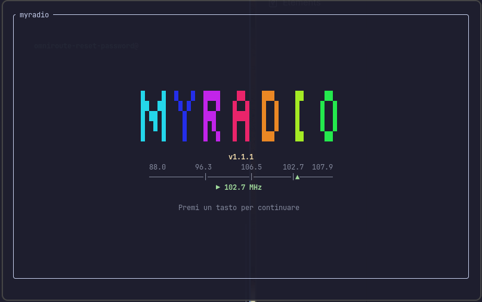
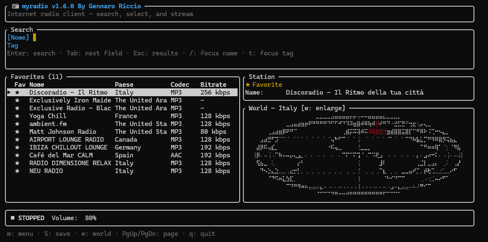
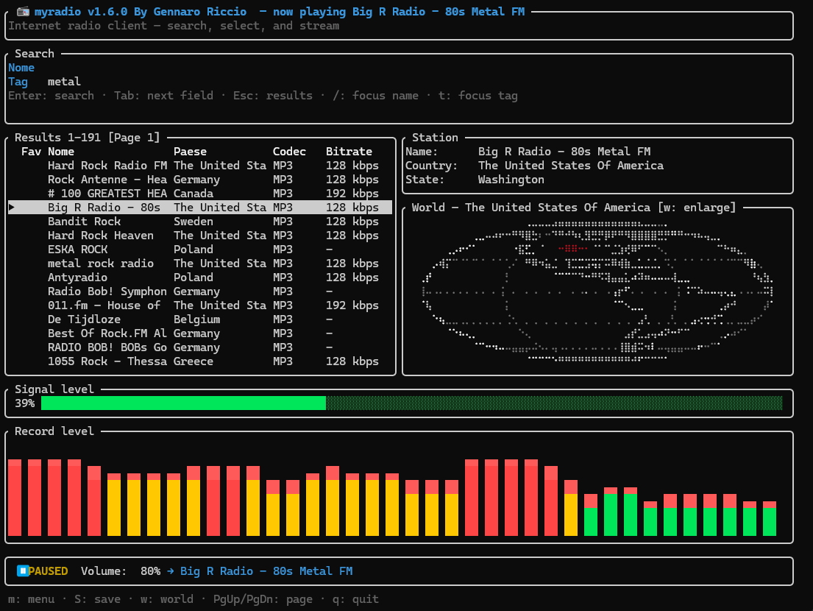

# myradio

A terminal UI (TUI) for listening to internet radio. Searches stations via
[Radio Browser](https://radio-browser.info), plays them with rodio
(MP3, AAC, OGG/Vorbis, FLAC, WAV), and shows the volume level in real time
(dBFS meter + level history as a sparkline).

## Build

- **Linux**: `pkg-config` + `libasound2-dev` (rodio's ALSA backend)
  ```sh
  sudo apt install -y pkg-config libasound2-dev
  ```
- **Windows**: no system dependencies (WASAPI); TLS via rustls
- **macOS**: native build only (no system dependencies)

```sh
cargo build --release
```

On startup the app shows a splash screen with an ASCII-art `myradio` logo, the
version, and an animated FM tuner scanning stations. The splash is dismissed by
any key or after a few seconds.

## Demo

<video src="demo/myradio_demo.mp4" controls width="640" height="480"></video>

### Screenshots





## Release builds for Linux, Windows and macOS

`scripts/build-release.sh` builds and copies the final binary into `dist/`:

```sh
scripts/build-release.sh          # native build for the current OS
scripts/build-release.sh --all    # native + cross-compiled Windows (from Linux)
scripts/build-release.sh --windows
```

- Linux: requires `pkg-config` + `libasound2-dev`.
- Windows: from Linux needs `mingw-w64` (`sudo apt install -y mingw-w64`);
  on Windows a native build is enough.
- macOS: native build only; cross-compilation from other hosts is unsupported.

## Usage

```sh
cargo run --release
```

| Key | Action |
|---|---|
| `/` or `i` | focus the name search box |
| `t` | focus the tag filter |
| `Tab` | next field |
| `Enter` | run search / play the selected station |
| `↑`/`↓` or `j`/`k` | move selection |
| `p` or `Space` | pause/resume (or start selection) |
| `s` | stop |
| `+` / `-` | volume |
| `v` | toggle the audio visualizer |
| `q` or `Ctrl-C` | quit |

## Logs

Logs are written to `logs/` (never to the TUI): one file per day
(`myradio.<date>.log`), at most 7 files are kept, and only `WARN`/errors are
recorded.

## Architecture

- `src/radio.rs` — Radio Browser provider and `Station` model
- `src/audio.rs` — rodio engine on a dedicated thread, interruptible/rewindable
  network reader, `LevelSource` for real-time level sampling
- `src/levels.rs` — shared dBFS↔percentage levels
- `src/artwork.rs` — async favicon download, disk + memory cache, and
  half-block rendering of station artwork (works in any terminal)
- `src/app.rs` — state machine and input handling
- `src/ui.rs` — ratatui rendering (header, search, results, station info, audio
  meter/history, status bar, help, startup splash)
- `src/main.rs` — entry point and logging setup

## Verification

```sh
cargo test
cargo clippy --all-targets -- -D warnings
cargo fmt --check
```